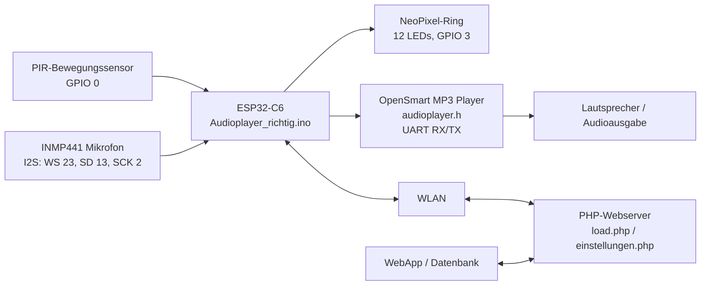
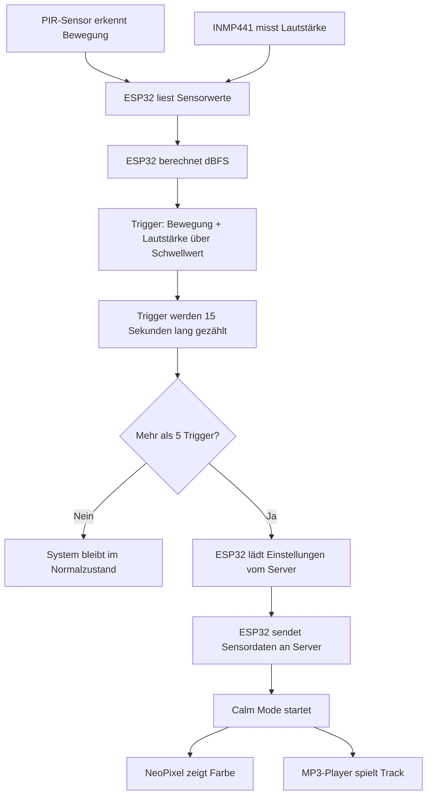
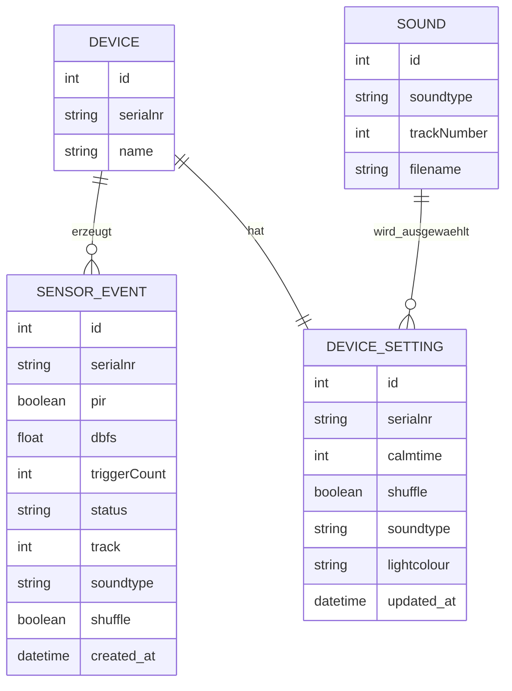

# 🔑👤 Authentifizierung Minimal (Boilerplate)


> 🎨 Dieses Boilerplate kann entweder in einem Code-Along Schritt für Schritt gemeinsam erarbeitet werden oder fixfertig auf einem Webserver installiert werden.

Dieses Repository beinhaltet ein vollständiges, minimales Authenzifizierungs-System basierend auf PHP als Backend und HTML/CSS/JS als Frontend.

Es ermöglicht Benutzern das `Registrieren`, `Anmelden`, `Abmelden` und den Zugriff auf eine `geschützte Seite` nach erfolgreicher Authentifizierung.

Eine einfache Erklärung des Login-Ablaufs mit Sessions und Cookies findest du in [`sessions.md`](sessions.md).

# 🏁 Live - Version

Du kannst Homely unter folgendem Link testen:

[https://im4.crazy-internet.ch/](https://im4.crazy-internet.ch/)

## ⚙️ Installation

Um dieses Boilerplate auf dem eigenen Web-Server zu installieren, führe folgende Schritte aus:

### 1. Download

- [Klone das Repository](https://docs.github.com/en/repositories/creating-and-managing-repositories/cloning-a-repository) über GitHub oder [downloade das Repository als ZIP Datei](https://docs.github.com/en/repositories/working-with-files/using-files/downloading-source-code-archives) auf deinen eigenen Computer.

### 2. Datenbank

- Erstelle eine neue Datenbank bei deinem Hoster (z.B. [Infomaniak](https://www.infomaniak.com/de/support/faq/1981/mysqlmariadb-benutzer-und-datenbanken-verwalten)).

- Importiere die Datei `system/database.sql` in die neue Datenbank, um die `users` Tabelle zu erstellen.

### 3. Code

- Benenne die Datei `system/config.php.blank` in `system/config.php` um.

- Passe die Datenbankverbindungsdaten in der Datei `system/config.php` an.

### 4. FTP Connect

- Erstelle eine neue FTP Verbindung mit dem SFTP Plugin gemäss [Anleitung im MMP 101](https://github.com/Interaktive-Medien/101-MMP/blob/main/resources/sftp.md).

# 📁 Struktur

## 🎨 Frontend

### root (Basis-Verzeichnis)

- beinhaltet alle HTML-Dateien des Frontends.
- beinhaltet die `.gitignore` Datei, welche die Dateien und Verzeichnisse ausblendet, die nicht auf GitHub hochgeladen werden sollen.

### js

- beinhaltet alle JavaScript-Dateien des Frontends.

### css

- beinhaltet alle CSS-Dateien des Frontends.

## 🤖 Backend

### api

- Beinhaltet alle API-Endpunkte des Backends.
- Diese Dateien werden von `JavaScript` aufgerufen und geben eine Antwort an `JavaScript` zurück.

### system

- Beinhaltet die Konfigurationsdatei für die Datenbankverbindung.
- Beinhaltet die Datei `database.sql`, die die `users` Tabelle erstellt.
- Beinhaltet die Datei `config.php`, die die Konfiguration des Backends enthält.


# Projektdokumentation: Audioplayer Physical Computing

## Kurzbeschreibung

Unser Physical Computigt erkennt über einen PIR-Sensor Bewegung und misst über ein digitales INMP441-I2S-Mikrofon die Lautstärke der Umgebung. Wenn innerhalb eines Zeitfensters von 15 Sekunden mehrfach Bewegung und erhöhte Lautstärke erkannt werden, wird ein sogenannter Calm Mode gestartet. In diesem Modus leuchtet ein NeoPixel-LED-Ring in einer vom Server geladenen Farbe und ein OpenSmart-MP3-Player spielt einen beruhigenden Audiotrack ab.

Die Einstellungen für den Calm Mode werden über WLAN von einem Webserver geladen. Dazu gehören die Spieldauer, die Lichtfarbe, die Auswahl des Audiotracks und die Shuffle-Einstellung. Wenn ein Alarmzustand erkannt wird, sendet der ESP32 Sensordaten und Statusinformationen als JSON an den Server.

Verwendete Programmdateien:

- `Audioplayer_richtig.ino`
- `audioplayer.h`

---

## Bauanleitung Physical Computing

### Was muss gebaut, verbunden und installiert werden?

Für den Aufbau werden ein ESP32-C6, ein PIR-Bewegungssensor, ein INMP441-Mikrofon, ein NeoPixel-LED-Ring, ein OpenSmart-MP3-Player-Modul, eine SD-Karte mit Audiodateien und ein Lautsprecher benötigt. Der ESP32-C6 ist die zentrale Steuereinheit. Er liest die Sensorwerte ein, entscheidet über den Systemzustand, kommuniziert mit dem Server und steuert die Aktoren.

Zuerst muss die Arduino IDE eingerichtet werden. In der Arduino IDE muss das passende ESP32-Boardpaket installiert sein, damit der ESP32-C6 programmiert werden kann. Zusätzlich werden die Bibliotheken `Adafruit_NeoPixel` und `ArduinoJson` benötigt. Die Bibliotheken `WiFi.h`, `HTTPClient.h`, `driver/i2s.h` und `math.h` werden über die ESP32-Arduino-Umgebung beziehungsweise den Standardumfang bereitgestellt.

Die beiden Projektdateien müssen im gleichen Arduino-Projektordner liegen. Die Hauptdatei `Audioplayer_richtig.ino` bindet die Datei `audioplayer.h` mit folgendem Befehl ein:

```cpp
#include "audioplayer.h"
```

Dadurch kann die Hauptdatei auf die Funktionen zur Steuerung des MP3-Players zugreifen.

Nach dem Verdrahten wird der Sketch auf den ESP32-C6 hochgeladen. Beim Start verbindet sich der ESP32 mit dem WLAN, initialisiert das I2S-Mikrofon, startet den MP3-Player und setzt den NeoPixel-Ring zunächst aus. Danach beginnt die laufende Messung von Bewegung und Lautstärke.

### Benötigte Komponenten

| Komponente | Aufgabe im Projekt |
|---|---|
| ESP32-C6 | Zentrale Steuereinheit, WLAN-Kommunikation, Sensor- und Aktorsteuerung |
| PIR-Bewegungssensor | Erkennt Bewegung im Raum |
| INMP441-I2S-Mikrofon | Misst die Umgebungslautstärke digital über I2S |
| NeoPixel-LED-Ring mit 12 LEDs | Gibt im Calm Mode eine farbige Lichtausgabe aus |
| OpenSmart-MP3-Player | Spielt Audiodateien von einer SD-Karte ab |
| SD-Karte | Speichert die Audiodateien |
| Lautsprecher | Gibt den abgespielten Audiotrack hörbar aus |
| WLAN / Webserver | Überträgt Einstellungen und Sensordaten |

---

## Komponentenplan

Der Komponentenplan zeigt, welche Teile miteinander verbunden sind und über welche Kommunikationswege sie Daten austauschen.



### Eingesetzte Komponenten

Das Projekt verwendet den ESP32-C6 als Mikrocontroller. Daran angeschlossen sind zwei Sensoren: ein PIR-Bewegungssensor und ein INMP441-Mikrofon. Als Aktoren werden ein NeoPixel-LED-Ring und ein OpenSmart-MP3-Player verwendet. Der MP3-Player gibt Audiodateien über einen Lautsprecher aus. Zusätzlich kommuniziert der ESP32 über WLAN mit einem externen Webserver.

### Sensoren und Aktoren

Der PIR-Sensor liefert ein digitales Signal. Bei erkannter Bewegung gibt er ein HIGH-Signal aus. Das INMP441-Mikrofon liefert digitale Audiodaten über die I2S-Schnittstelle. Aus diesen Daten berechnet der ESP32 einen dBFS-Wert, also einen digitalen Lautstärkewert.

Der NeoPixel-Ring wird über ein digitales Datensignal angesteuert und zeigt im Calm Mode eine Farbe an. Der OpenSmart-MP3-Player wird über UART gesteuert. Der ESP32 sendet serielle Befehle an das MP3-Modul, zum Beispiel zum Starten oder Stoppen eines Tracks.

### Programme mit Dateinamen

`Audioplayer_richtig.ino` enthält die Hauptlogik des Systems. Dazu gehören WLAN-Verbindung, Sensorauswertung, Trigger-Zählung, HTTP-Kommunikation, JSON-Verarbeitung, LED-Steuerung und Calm-Mode-Ablauf.

`audioplayer.h` enthält die ausgelagerte Steuerung des MP3-Players. In dieser Datei sind die UART-Pins, die Befehle für den MP3-Player und die Funktionen `initAudioPlayer()`, `playTrack()` und `stopTrack()` definiert.

### Kommunikationswege

| Verbindung | Kommunikationsart | Beschreibung |
|---|---|---|
| PIR-Sensor zu ESP32 | Digitales Signal | Bewegung wird als HIGH oder LOW erkannt |
| INMP441 zu ESP32 | I2S | Audiodaten werden digital übertragen |
| ESP32 zu NeoPixel | Digitales LED-Protokoll | RGB-Farbe wird an alle LEDs gesendet |
| ESP32 zu MP3-Player | UART / Serial | Tracknummern und Steuerbefehle werden gesendet |
| ESP32 zu Webserver | WLAN + HTTPS | Einstellungen werden geladen und Sensordaten gesendet |
| WebApp / Datenbank zu Server-API | Serverseitige Schnittstelle | WebApp verwaltet Einstellungen und gespeicherte Messdaten |

---

## Steckplan

Der Steckplan kann zum Beispiel in Fritzing, Tinkercad oder Wokwi nachgebaut werden. Für diese Abgabe ist Fritzing besonders passend, weil dafür im Modul zusätzliche Fritzing Parts bereitgestellt wurden.

### Pinbelegung

| Bauteil | Anschluss am Bauteil | Anschluss am ESP32-C6 | Zweck |
|---|---:|---:|---|
| PIR-Sensor | OUT | GPIO 0 | Bewegungssignal |
| PIR-Sensor | VCC | 3.3V oder 5V je nach Sensor | Stromversorgung |
| PIR-Sensor | GND | GND | Masse |
| INMP441 | WS / LRCL | GPIO 23 | I2S Word Select |
| INMP441 | SD | GPIO 13 | I2S Audiodaten |
| INMP441 | SCK / BCLK | GPIO 2 | I2S Clock |
| INMP441 | VCC | 3.3V | Stromversorgung |
| INMP441 | GND | GND | Masse |
| NeoPixel-Ring | DIN | GPIO 3 | LED-Datenleitung |
| NeoPixel-Ring | VCC | 5V oder 3.3V je nach Ring | Stromversorgung |
| NeoPixel-Ring | GND | GND | Masse |
| MP3-Player | RX | GPIO 6 / ESP TX | Befehle vom ESP32 zum MP3-Player |
| MP3-Player | TX | GPIO 7 / ESP RX | Rückkanal vom MP3-Player zum ESP32 |
| MP3-Player | GND-Steuerung | GPIO 5 über Transistor | Kontrolliertes Einschalten |
| MP3-Player | VCC | passend zum Modul | Stromversorgung |
| MP3-Player | Speaker Out | Lautsprecher | Audioausgabe |

Wichtig ist, dass alle Komponenten eine gemeinsame Masse haben. ESP32, Sensoren, LED-Ring und MP3-Player müssen also über GND verbunden sein. Beim MP3-Player müssen RX und TX gekreuzt werden: TX vom ESP32 geht an RX des MP3-Players, RX vom ESP32 geht an TX des MP3-Players.

Beim NeoPixel-Ring sollte auf eine ausreichend stabile Stromversorgung geachtet werden. Wenn viele LEDs gleichzeitig hell leuchten, kann der Strombedarf höher sein als bei einfachen Sensoren. In einer realen Schaltung ist außerdem ein kleiner Widerstand in der Datenleitung und ein Kondensator an der Versorgung des LED-Rings sinnvoll.

---

## Bildmaterial

Steckplan: siehe Foto 

---

## Technische Details

### Projektstruktur / Code-Struktur

Das Projekt besteht aus zwei zentralen Dateien.


Audioplayer_richtig/
├── Audioplayer_richtig.ino
└── audioplayer.h


Die Datei `Audioplayer_richtig.ino` ist die Hauptdatei. Sie enthält die globale Konfiguration, die Initialisierung im `setup()` und die laufende Programmlogik in `loop()`. In dieser Datei werden die WLAN-Daten, die Server-URLs, die Sensorpins, die NeoPixel-Konfiguration, die I2S-Konfiguration und die Systemparameter definiert.

Die Datei `audioplayer.h` ist eine Hilfsdatei für den MP3-Player. Sie kapselt die serielle Kommunikation mit dem OpenSmart-MP3-Player. Dadurch bleibt die Hauptdatei übersichtlicher, weil die MP3-spezifischen Befehle ausgelagert sind.

### Ablauf im Programm

Beim Start wird in `setup()` zuerst die serielle Ausgabe aktiviert. Danach werden PIR-Sensor, Built-in-LED, NeoPixel-Ring, WLAN, I2S-Mikrofon und MP3-Player initialisiert. Nach erfolgreichem Start gibt das System über den Serial Monitor aus, dass es gestartet wurde.

In der `loop()`-Funktion wird zuerst geprüft, ob der Calm Mode aktiv ist. Wenn ja, wartet das System nur darauf, dass die eingestellte Abspielzeit abläuft. Danach wird der Calm Mode beendet. Während des Calm Mode werden keine neuen Sensortrigger verarbeitet.

Wenn der Calm Mode nicht aktiv ist, liest das System den PIR-Sensor und den aktuellen Lautstärkewert. Ein Trigger entsteht nur dann, wenn Bewegung erkannt wird und gleichzeitig die Lautstärke über dem Schwellwert liegt. Der Schwellwert ist im Code so definiert:

```cpp
const float SOUND_THRESHOLD = -40;
```

Das System zählt Trigger innerhalb eines Zeitfensters von 15 Sekunden:

```cpp
const unsigned long WINDOW_TIME = 15000;
const int TRIGGER_LIMIT = 5;
```

Wenn nach Ablauf dieses Zeitfensters mehr als fünf Trigger erkannt wurden, lädt der ESP32 die aktuellen Einstellungen vom Server, sendet die Sensordaten an den Server und startet den Calm Mode.

### Verarbeitung der Lautstärke

Das INMP441-Mikrofon liefert digitale Audiosamples über I2S. In `initI2S()` wird die I2S-Schnittstelle mit einer Sample Rate von 16000 Hz eingerichtet. Die Funktion `getDB()` liest die Audiodaten, berechnet daraus einen RMS-Wert und wandelt diesen in dBFS um.

Der Wert wird anschließend begrenzt und geglättet. Die Begrenzung liegt zwischen -90 dB und 0 dB. Die Glättung verhindert, dass einzelne sehr kurze Ausschläge die Messung zu stark beeinflussen. Dadurch reagiert das System stabiler.

### Calm Mode

Der Calm Mode wird durch `playCalm()` gestartet. In diesem Modus passiert Folgendes:

1. `playCalmBool` wird auf `true` gesetzt.
2. Die Startzeit wird gespeichert.
3. Die Built-in-LED wird eingeschaltet.
4. Der abzuspielende Track wird bestimmt.
5. Der NeoPixel-Ring zeigt die vom Server geladene Farbe.
6. Der MP3-Player startet den ausgewählten Track.

Wenn `userShuffle` aktiv ist, wird ein zufälliger Track zwischen 1 und 6 abgespielt. Wenn Shuffle deaktiviert ist, wird der Track verwendet, der über den Serverwert `soundtype` bestimmt wurde.

Die Reihenfolge der Sounds ist im Code so definiert:

```cpp
const char* SOUND_NAMES[MAX_TRACK] = {
    "voice_1",
    "voice_2",
    "voice_3",
    "story_1",
    "story_2",
    "story_3",
    "music_1",
    "music_2",
    "music_3"
};
Bei Voice ist keine Audio hinterlegt. Da dort die Eltern persönliche Nachrichten auf die SD-Karte laden können. 
```

Das bedeutet:

| Tracknummer | Soundname |
|---:|---|
| 1 | story_1 |
| 2 | story_2 |
| 3 | story_3 |
| 4 | music_1 |
| 5 | music_2 |
| 6 | music_3 |

Die Dateinamen auf der SD-Karte müssen zur Reihenfolge des MP3-Players passen, weil der MP3-Player über Tracknummern angesteuert wird.

---

## Datenschnittstelle zwischen WebApp und Physical Computing

Die Kommunikation zwischen WebApp beziehungsweise Server und ESP32 läuft über HTTP-Anfragen mit JSON-Daten. Der ESP32 verbindet sich dafür mit dem WLAN und spricht zwei PHP-Endpunkte an.

### Einstellungen laden

Der ESP32 lädt Einstellungen über diese URL:

```text
https://im4.vanessa-oberhaensli.ch/api/einstellungen.php?serialnr=SleShep1
```

Die Anfrage ist ein HTTP-GET-Request. Die Seriennummer `SleShep1` wird als URL-Parameter mitgegeben. Dadurch kann der Server passende Einstellungen für genau dieses Gerät zurückgeben.

Der ESP32 erwartet eine JSON-Antwort. Aus der Antwort werden diese Felder gelesen:

| Feld | Bedeutung im ESP32 |
|---|---|
| `calmtime` | Spieldauer des Calm Mode in Minuten |
| `shuffle` | Gibt an, ob ein zufälliger Track abgespielt wird |
| `soundtype` | Name des gewünschten Sounds |
| `lightcolour` | HEX-Farbwert für den NeoPixel-Ring |

Der Wert `calmtime` wird im Code von Minuten in Millisekunden umgerechnet. Der Wert `shuffle` wird in einen Boolean umgewandelt. Der Wert `soundtype` wird mit der Liste `SOUND_NAMES` verglichen und dadurch einer Tracknummer zugeordnet. Der Wert `lightcolour` wird als HEX-Farbe gelesen und in RGB-Werte umgewandelt.

### Sensordaten senden

Wenn ein Alarm erkannt wurde, sendet der ESP32 Daten per HTTP-POST an:

```text
https://im4.vanessa-oberhaensli.ch/api/load.php
```

Die Daten werden als JSON mit dem Header `Content-Type: application/json` gesendet. Im Code werden unter anderem folgende Werte übertragen:

| JSON-Feld | Bedeutung |
|---|---|
| `serialnr` | Seriennummer des Geräts |
| `pir` | Letzter Bewegungszustand |
| `dbfs` | Letzter Lautstärkewert in dBFS |
| `triggerCount` | Anzahl der Trigger im Zeitfenster |
| `status` | Status, im Alarmfall `"alarm"` |
| `track` | Aktuell ausgewählter Audiotrack |
| `soundtype` | Gewählter Soundtyp |
| `shuffle` | Shuffle-Einstellung |

Ein mögliches JSON-Paket sieht so aus:

```json
{
  "serialnr": "SleShep1",
  "pir": true,
  "dbfs": -32.5,
  "triggerCount": 6,
  "status": "alarm",
  "track": 2,
  "soundtype": "story_2",
  "shuffle": false
}
```

Im Code wird zusätzlich das Feld `seralnr` gesendet. Das ist sehr wahrscheinlich ein Tippfehler und sollte eigentlich `serialnr` heissen. Da `serialnr` ebenfalls korrekt gesendet wird, kann der Server trotzdem die richtige Seriennummer verwenden, wenn er das korrekte Feld ausliest.

### Datenweg

Der komplette Datenweg sieht so aus:



---

## ERM

Aus dem Arduino-Code lässt sich ableiten, dass serverseitig mindestens Geräte, Einstellungen und Sensordaten verwaltet werden. Da der tatsächliche Datenbankcode nicht in den Arduino-Dateien enthalten ist, ist das folgende ERM eine sinnvolle Rekonstruktion auf Basis der verwendeten JSON-Felder und URLs.



### Erklärung des ERM

Die Entität `DEVICE` beschreibt ein physisches Gerät. Im Code wird das Gerät über die Seriennummer `SleShep1` identifiziert. Diese Seriennummer wird sowohl beim Laden der Einstellungen als auch beim Senden der Sensordaten verwendet.

Die Entität `DEVICE_SETTING` enthält die Einstellungen, die vom Server an den ESP32 zurückgegeben werden. Dazu gehören die Dauer des Calm Mode (`calmtime`), die Shuffle-Einstellung (`shuffle`), der gewünschte Sound (`soundtype`) und die Lichtfarbe (`lightcolour`). Jedes Gerät hat genau einen aktuellen Einstellungssatz.

Die Entität `SENSOR_EVENT` enthält Mess- und Ereignisdaten, die der ESP32 an den Server sendet. Dazu gehören der PIR-Zustand, der Lautstärkewert, die Anzahl der Trigger, der Status und Informationen zum abgespielten Track. Ein Gerät kann viele Sensorereignisse erzeugen.

Die Entität `SOUND` beschreibt die verfügbaren Audiodateien. Im Arduino-Code sind sechs Soundnamen definiert. Diese Soundnamen können serverseitig mit Tracknummern oder Dateinamen verbunden werden. Die WebApp kann dann einen Soundtyp auswählen, den der ESP32 später in eine Tracknummer übersetzt.

---

## Authentifizierung

Im vorhandenen Arduino-Code gibt es keine klassische Authentifizierung über Benutzername, Passwort, API-Key, Bearer Token oder Session. Der ESP32 identifiziert sich hauptsächlich über die fest im Code gespeicherte Seriennummer:

```cpp
const char* serialNumber = "SleShep1";
```

Diese Seriennummer wird beim Laden der Einstellungen als URL-Parameter verwendet:

```text
einstellungen.php?serialnr=SleShep1
```

Beim Senden der Sensordaten wird die Seriennummer zusätzlich im JSON-Body übertragen. Dadurch kann der Server die Daten einem bestimmten Gerät zuordnen.

Die WLAN-Verbindung ist durch SSID und Passwort geschützt. Außerdem werden HTTPS-URLs verwendet. HTTPS schützt die Datenübertragung auf dem Weg zwischen ESP32 und Server, weil die Verbindung verschlüsselt ist. Trotzdem ersetzt HTTPS keine richtige API-Authentifizierung. Jede Person, die die Seriennummer und die API-URL kennt, könnte theoretisch versuchen, Daten an den Server zu senden oder Einstellungen abzufragen, falls der Server keine weiteren Schutzmechanismen nutzt.

Für eine sicherere Umsetzung wäre ein zusätzlicher API-Key sinnvoll. Dieser könnte bei jedem Request als HTTP-Header mitgeschickt werden. Der Server würde dann prüfen, ob der API-Key gültig ist und zur Seriennummer passt. Außerdem sollten WLAN-Passwort und API-Geheimnisse nicht in einem öffentlich abgegebenen Repository stehen. Besser wäre eine separate Konfigurationsdatei, die nicht veröffentlicht wird, oder eine Eingabe über ein geschütztes Setup-Verfahren.

Zusammengefasst verwendet das aktuelle Projekt eine gerätebasierte Identifikation über die Seriennummer, aber keine starke Authentifizierung. Für einen Prototyp im Studienkontext ist das nachvollziehbar, für einen produktiven Einsatz müsste die Schnittstelle stärker geschützt werden.

---

## Zusammenfassung

Das Projekt verbindet Sensorik, Aktorik und Webkommunikation zu einem interaktiven Physical-Computing-System. Der ESP32-C6 erkennt Bewegung und Lautstärke, zählt Ereignisse innerhalb eines Zeitfensters und reagiert bei Überschreitung eines Grenzwerts mit Licht und Audio. Die WebApp beziehungsweise der Server steuert dabei wichtige Einstellungen wie Farbe, Soundauswahl, Shuffle und Abspieldauer. Dadurch entsteht ein System, bei dem physische Eingaben aus der Umgebung mit digitalen Einstellungen und serverseitiger Datenspeicherung kombiniert werden.
