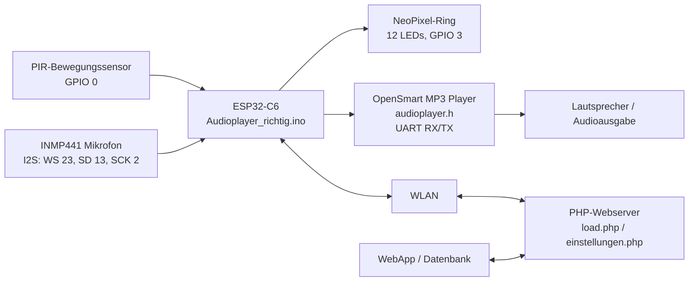
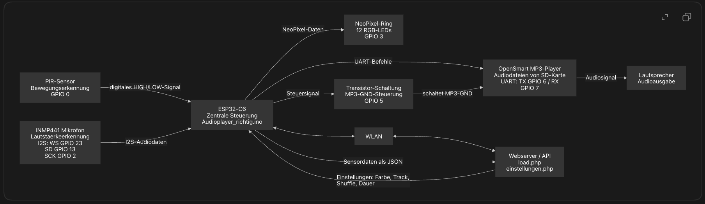
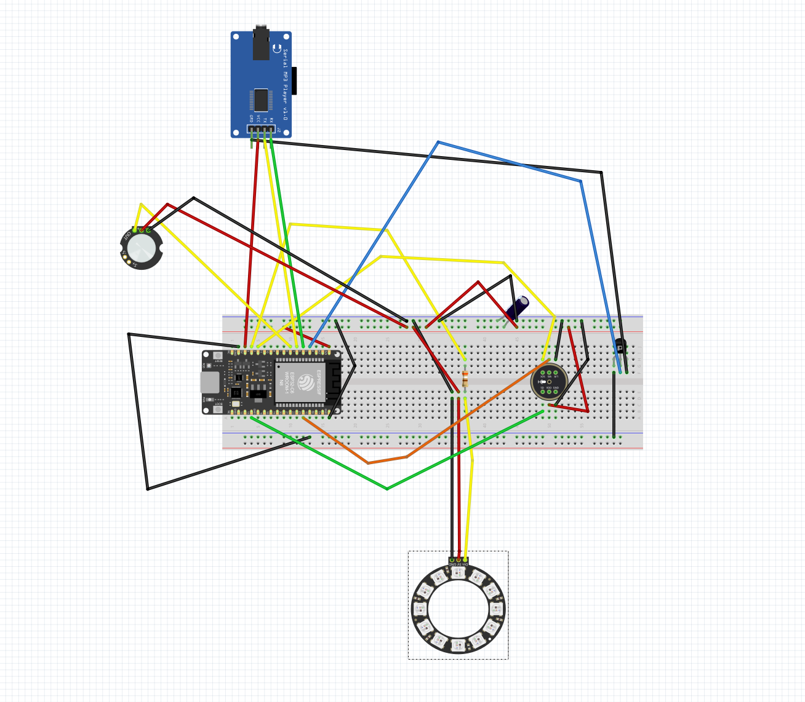
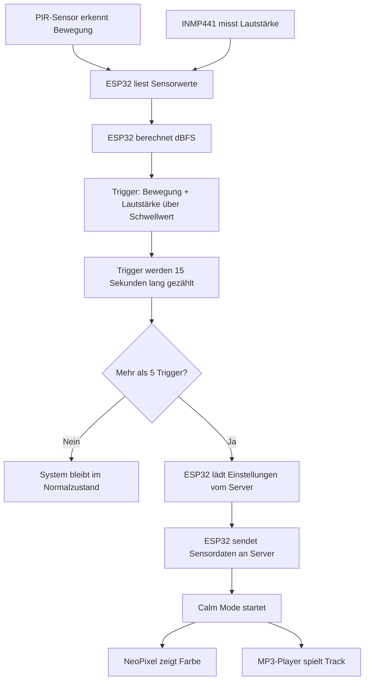
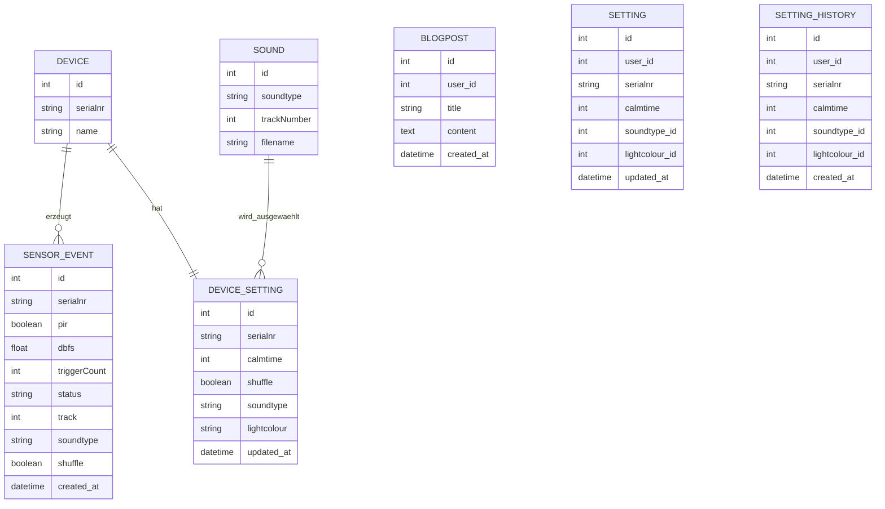

## Kurzbeschreibung des Projekts

•⁠  ⁠*Modul:* Interaktive Medien 4 an der Fachhochschule Graubünden (FS26)  
•⁠  ⁠*Themenfeld:* IoT-Applikation zum Thema Eltern mit kleinen Kindern  
•⁠  ⁠*Name des Projekts:* \[SleepySheepy\]   
•⁠  ⁠*Team Physical Computing:* \[Moena Bischoff, Melissa Goebel\]   
•⁠  ⁠*Team WebApp:* \[Vanessa Oberhänsli, Lynn Hartmann\]
 
 
### Welches Problem im Alltag von Eltern mit kleinen Kindern wird gelöst? 

Viele Kinder im Vorschulalter wachen nachts auf und benötigen Unterstützung, um wieder einzuschlafen. Oft rufen sie ihre Eltern, wodurch deren Schlaf unterbrochen wird. Gleichzeitig ist das selbstständige Wiedereinschlafen eine wichtige Entwicklungsaufgabe für Kinder. Eltern stehen daher vor der Herausforderung, ihrem Kind Sicherheit und Geborgenheit zu geben, ohne bei jedem nächtlichen Aufwachen direkt eingreifen zu müssen.

SleepySheepy unterstützt Kinder dabei, sich bei nächtlichem Aufwachen selbst zu beruhigen und wieder in den Schlaf zu finden. Gleichzeitig erhalten Eltern Einblick in die nächtlichen Aktivitäten ihres Kindes, ohne ständig präsent sein zu müssen.


### Was ist der Sinn und Zweck des Systems?

SleepySheepy ist ein intelligentes Plüschtier mit begleitender Web-App, das die nächtliche Selbstregulation von Kindern fördert und Eltern entlastet. Das System begleitet Kinder zunächst beim Einschlafen durch beruhigende Inhalte wie Geschichten, Musik oder Sprachaufnahmen der Eltern. Nach dem Einschlafen überwacht das Plüschtier mithilfe von Bewegungs- und Geräuschsensoren die Aktivität des Kindes. Wird über einen definierten Zeitraum Unruhe erkannt, aktiviert das System automatisch individuell festgelegte Beruhigungsfunktionen wie Licht oder Audio-Inhalte.

Die erfassten Sensordaten werden in einer Datenbank gespeichert und in der Web-App visualisiert. Eltern können dort Einstellungen verwalten, Beruhigungsinhalte auswählen und die nächtlichen Aktivitäten ihres Kindes nachvollziehen.

Das Ziel des Systems ist es, Kindern mehr Selbstständigkeit beim Wiedereinschlafen zu ermöglichen und Eltern gleichzeitig Sicherheit, Transparenz und Entlastung im Familienalltag zu bieten.

### UX & Konzeption

**Figma:** [Link zum Figma]( https://www.figma.com/design/ttmTtepUD14OOeOQiDrhcn/IM-4-%E2%80%93-App-Konzeption-Vorlage--Kopie-?node-id=78-325&p=f)
**User Flow \+ Screen Flow** (Screenshot aus Figma) 
(/Bilder_Readme/image.png)
 
*In Figma wurden der User Flow und der Screen Flow für beide Projektteile erstellt. Der Flow zeigt, wie Nutzer durch die WebApp navigieren und wie die wichtigsten Funktionen miteinander verbunden sind.

Für die WebApp wurden insbesondere Registrierung, Login, Home-Ansicht, Profil, Licht- und Soundsteuerung sowie die Statistik- und Kalenderansicht geplant.

* *Welche Features waren angedacht?*
*Registrierung und Login
*Profilbereich für persönliche Informationen
*Home-Ansicht mit Übersicht zur letzten Nacht
*Steuerung von Licht und Sound über die WebApp
*Statistikseite mit Monatsübersicht
*Kalenderansicht zur Bewertung einzelner Nächte
*Detailansicht für einzelne Tage bzw. Nächte

* *Welche Features wurden nicht umgesetzt? (Warum)*
*Vollständige Automatisierung der Schlafauswertung: Die Auswertung wurde vereinfacht, da die stabile Darstellung der wichtigsten Schlafdaten im Vordergrund stand.

*Erweiterte Detailanalysen: Zusätzliche Auswertungen und Vergleiche wurden nicht vollständig umgesetzt, da sie den Rahmen des Projekts überschritten hätten.

*Feinschliff einzelner Interaktionen: Einzelne UI-Details und Animationen wurden reduziert, damit die Grundfunktionen zuverlässig funktionieren.

### Setup
* **WebApp:** [Link zur Website]( https://im4.vanessa-oberhaensli.ch/login.html)  
* **Video-Dokumentation:** [Link zum Video auf Youtube] (https://youtu.be/a2KxjekczdM) 

#### Installationsanleitung WebApp

*Was benötige ich an Infrastruktur?*  
Für die Installation und den Betrieb der WebApp wird eine Webserver-Umgebung benötigt. Die WebApp besteht aus HTML-, CSS-, JavaScript- und PHP-Dateien und benötigt zusätzlich eine MySQL-Datenbank zur Speicherung von Benutzerdaten, Blogbeiträgen, Einstellungen und Sensordaten.

*Was muss ich auf meinem Webserver installieren?* 
Auf dem Webserver muss keine zusätzliche Software manuell installiert werden, sofern bereits ein normales Webhosting mit PHP und MySQL vorhanden ist. Wichtig ist, dass der Server PHP unterstützt und Zugriff auf eine MySQL- oder MariaDB-Datenbank bietet.

*Wie kann ich die Datenbank importieren?*  
Zuerst wird in phpMyAdmin eine neue Datenbank erstellt. Anschliessend kann die mitgelieferte SQL-Datei über den Bereich «Importieren» ausgewählt und ausgeführt werden. Dadurch werden die benötigten Tabellen und Strukturen angelegt.

*Wo muss ich die DB-Credentials eintragen?*  
Die Zugangsdaten zur Datenbank müssen in der PHP-Datei eingetragen werden, in der die Datenbankverbindung definiert ist. Dort werden Datenbank-Host, Datenbankname, Benutzername und Passwort angepasst.
$host = "localhost";
$dbname = "[Datenbankname]";
$username = "[Benutzername]";
$password = "[Passwort]";

*Wie nehme ich das physische Artefakt in Betrieb?*
Die Inbetriebnahme des physischen Artefakts wird separat im Abschnitt «Bauanleitung Physical Computing» dokumentiert. Dort wird beschrieben, wie das Plüschtier beziehungsweise die verbaute Hardware aufgebaut, angeschlossen und mit der WebApp verbunden wird.

Für die WebApp ist vor allem wichtig, dass das physische Artefakt eine gültige Seriennummer verwendet. Diese Seriennummer muss mit der Seriennummer übereinstimmen, die in der WebApp beziehungsweise in der Datenbank hinterlegt ist. Nur so können die Sensordaten korrekt zugeordnet und die gespeicherten Einstellungen an das richtige Plüschtier übermittelt werden.


# Projektdokumentation: Audioplayer Physical Computing

## Kurzbeschreibung

Unser Physical Computing erkennt über einen PIR-Sensor Bewegung und misst über ein digitales INMP441-I2S-Mikrofon die Lautstärke der Umgebung. Wenn innerhalb eines Zeitfensters von 15 Sekunden mehrfach Bewegung und erhöhte Lautstärke erkannt werden, wird ein sogenannter Calm Mode gestartet. In diesem Modus leuchtet ein NeoPixel-LED-Ring in einer vom Server geladenen Farbe und ein OpenSmart-MP3-Player spielt einen beruhigenden Audiotrack ab.

Die Einstellungen für den Calm Mode werden über WLAN von einem Webserver geladen. Dazu gehören die Spieldauer, die Lichtfarbe, die Auswahl des Audiotracks und die Shuffle-Einstellung. Wenn ein Alarmzustand erkannt wird, sendet der ESP32 Sensordaten und Statusinformationen als JSON an den Server.

Download-Link Arduino-Datei: https://www.swisstransfer.com/d/7c16fc65-6cbd-4e2f-9e3d-09d9b5c5cc30

Verwendete Programmdateien:

- `Audioplayer_richtig.ino`
- `audioplayer.h`

---

## Bauanleitung Physical Computing

### Was muss gebaut, verbunden und installiert werden?

Für den Aufbau werden ein ESP32-C6, ein PIR-Bewegungssensor, ein INMP441-Mikrofon, ein NeoPixel-LED-Ring, ein OpenSmart-MP3-Player-Modul, eine SD-Karte mit Audiodateien und ein Lautsprecher benötigt. Der ESP32-C6 ist die zentrale Steuereinheit. Er liest die Sensorwerte ein, entscheidet über den Systemzustand, kommuniziert mit dem Server und steuert die Aktoren.

Zuerst muss die Arduino IDE eingerichtet werden. In der Arduino IDE muss das passende ESP32-Boardpaket installiert sein, damit der ESP32-C6 programmiert werden kann. Zusätzlich werden die Bibliotheken `Adafruit_NeoPixel` und `ArduinoJson` benötigt. Die Bibliotheken `WiFi.h`, `HTTPClient.h`, `driver/i2s.h` und `math.h` werden über die ESP32-Arduino-Umgebung beziehungsweise den Standardumfang bereitgestellt.

Die beiden Projektdateien müssen im gleichen Arduino-Projektordner liegen. Die Hauptdatei `Audioplayer_richtig.ino` bindet die Datei `audioplayer.h` mit folgendem Befehl ein:

```cpp
#include "audioplayer.h"
```

Dadurch kann die Hauptdatei auf die Funktionen zur Steuerung des MP3-Players zugreifen.

Nach dem Verdrahten wird der Sketch auf den ESP32-C6 hochgeladen. Beim Start verbindet sich der ESP32 mit dem WLAN, initialisiert das I2S-Mikrofon, startet den MP3-Player und setzt den NeoPixel-Ring zunächst aus. Danach beginnt die laufende Messung von Bewegung und Lautstärke.

### Benötigte Komponenten

| Komponente | Aufgabe im Projekt |
|---|---|
| ESP32-C6 | Zentrale Steuereinheit, WLAN-Kommunikation, Sensor- und Aktorsteuerung |
| PIR-Bewegungssensor | Erkennt Bewegung im Raum |
| INMP441-I2S-Mikrofon | Misst die Umgebungslautstärke digital über I2S |
| NeoPixel-LED-Ring mit 12 LEDs | Gibt im Calm Mode eine farbige Lichtausgabe aus |
| OpenSmart-MP3-Player | Spielt Audiodateien von einer SD-Karte ab |
| SD-Karte | Speichert die Audiodateien |
| Lautsprecher | Gibt den abgespielten Audiotrack hörbar aus |
| WLAN / Webserver | Überträgt Einstellungen und Sensordaten |

---

## Komponentenplan

Der Komponentenplan zeigt, welche Teile miteinander verbunden sind und über welche Kommunikationswege sie Daten austauschen.



### Bildmaterial Komponentenplan



### Eingesetzte Komponenten

Das Projekt verwendet den ESP32-C6 als Mikrocontroller. Daran angeschlossen sind zwei Sensoren: ein PIR-Bewegungssensor und ein INMP441-Mikrofon. Als Aktoren werden ein NeoPixel-LED-Ring und ein OpenSmart-MP3-Player verwendet. Der MP3-Player gibt Audiodateien über einen Lautsprecher aus. Zusätzlich kommuniziert der ESP32 über WLAN mit einem externen Webserver.

### Sensoren und Aktoren

Der PIR-Sensor liefert ein digitales Signal. Bei erkannter Bewegung gibt er ein HIGH-Signal aus. Das INMP441-Mikrofon liefert digitale Audiodaten über die I2S-Schnittstelle. Aus diesen Daten berechnet der ESP32 einen dBFS-Wert, also einen digitalen Lautstärkewert.

Der NeoPixel-Ring wird über ein digitales Datensignal angesteuert und zeigt im Calm Mode eine Farbe an. Der OpenSmart-MP3-Player wird über UART gesteuert. Der ESP32 sendet serielle Befehle an das MP3-Modul, zum Beispiel zum Starten oder Stoppen eines Tracks.

### Programme mit Dateinamen

`Audioplayer_richtig.ino` enthält die Hauptlogik des Systems. Dazu gehören WLAN-Verbindung, Sensorauswertung, Trigger-Zählung, HTTP-Kommunikation, JSON-Verarbeitung, LED-Steuerung und Calm-Mode-Ablauf.

`audioplayer.h` enthält die ausgelagerte Steuerung des MP3-Players. In dieser Datei sind die UART-Pins, die Befehle für den MP3-Player und die Funktionen `initAudioPlayer()`, `playTrack()` und `stopTrack()` definiert.

### Kommunikationswege

| Verbindung | Kommunikationsart | Beschreibung |
|---|---|---|
| PIR-Sensor zu ESP32 | Digitales Signal | Bewegung wird als HIGH oder LOW erkannt |
| INMP441 zu ESP32 | I2S | Audiodaten werden digital übertragen |
| ESP32 zu NeoPixel | Digitales LED-Protokoll | RGB-Farbe wird an alle LEDs gesendet |
| ESP32 zu MP3-Player | UART / Serial | Tracknummern und Steuerbefehle werden gesendet |
| ESP32 zu Webserver | WLAN + HTTPS | Einstellungen werden geladen und Sensordaten gesendet |
| WebApp / Datenbank zu Server-API | Serverseitige Schnittstelle | WebApp verwaltet Einstellungen und gespeicherte Messdaten |


---

## Steckplan


### Pinbelegung

| Bauteil | Anschluss am Bauteil | Anschluss am ESP32-C6 | Zweck |
|---|---:|---:|---|
| PIR-Sensor | OUT | GPIO 0 | Bewegungssignal |
| PIR-Sensor | VCC | 3.3V oder 5V je nach Sensor | Stromversorgung |
| PIR-Sensor | GND | GND | Masse |
| INMP441 | WS / LRCL | GPIO 23 | I2S Word Select |
| INMP441 | SD | GPIO 13 | I2S Audiodaten |
| INMP441 | SCK / BCLK | GPIO 2 | I2S Clock |
| INMP441 | VCC | 3.3V | Stromversorgung |
| INMP441 | GND | GND | Masse |
| NeoPixel-Ring | DIN | GPIO 3 | LED-Datenleitung |
| NeoPixel-Ring | VCC | 5V oder 3.3V je nach Ring | Stromversorgung |
| NeoPixel-Ring | GND | GND | Masse |
| MP3-Player | RX | GPIO 6 / ESP TX | Befehle vom ESP32 zum MP3-Player |
| MP3-Player | TX | GPIO 7 / ESP RX | Rückkanal vom MP3-Player zum ESP32 |
| MP3-Player | GND-Steuerung | GPIO 5 über Transistor | Kontrolliertes Einschalten |
| MP3-Player | VCC | passend zum Modul | Stromversorgung |
| MP3-Player | Speaker Out | Lautsprecher | Audioausgabe |

Wichtig ist, dass alle Komponenten eine gemeinsame Masse haben. ESP32, Sensoren, LED-Ring und MP3-Player müssen also über GND verbunden sein. Beim MP3-Player müssen RX und TX gekreuzt werden: TX vom ESP32 geht an RX des MP3-Players, RX vom ESP32 geht an TX des MP3-Players.

Beim NeoPixel-Ring sollte auf eine ausreichend stabile Stromversorgung geachtet werden. Wenn viele LEDs gleichzeitig hell leuchten, kann der Strombedarf höher sein als bei einfachen Sensoren. In einer realen Schaltung ist außerdem ein kleiner Widerstand in der Datenleitung und ein Kondensator an der Versorgung des LED-Rings sinnvoll.

---

## Bildmaterial Steckplan



---

## Technische Details

### Projektstruktur / Code-Struktur

Das Gesamtprojekt besteht aus zwei zentralen Bereichen: dem Physical-Computing-Teil für das Plüschtier und der WebApp für die Bedienung durch die Eltern. 

Physical Computing

Das Projekt besteht aus zwei zentralen Dateien.


Audioplayer_richtig/
├── Audioplayer_richtig.ino
└── audioplayer.h


Die Datei `Audioplayer_richtig.ino` ist die Hauptdatei. Sie enthält die globale Konfiguration, die Initialisierung im `setup()` und die laufende Programmlogik in `loop()`. In dieser Datei werden die WLAN-Daten, die Server-URLs, die Sensorpins, die NeoPixel-Konfiguration, die I2S-Konfiguration und die Systemparameter definiert.

Die Datei `audioplayer.h` ist eine Hilfsdatei für den MP3-Player. Sie kapselt die serielle Kommunikation mit dem OpenSmart-MP3-Player. Dadurch bleibt die Hauptdatei übersichtlicher, weil die MP3-spezifischen Befehle ausgelagert sind.

### Ablauf im Programm

Beim Start wird in `setup()` zuerst die serielle Ausgabe aktiviert. Danach werden PIR-Sensor, Built-in-LED, NeoPixel-Ring, WLAN, I2S-Mikrofon und MP3-Player initialisiert. Nach erfolgreichem Start gibt das System über den Serial Monitor aus, dass es gestartet wurde.

In der `loop()`-Funktion wird zuerst geprüft, ob der Calm Mode aktiv ist. Wenn ja, wartet das System nur darauf, dass die eingestellte Abspielzeit abläuft. Danach wird der Calm Mode beendet. Während des Calm Mode werden keine neuen Sensortrigger verarbeitet.

Wenn der Calm Mode nicht aktiv ist, liest das System den PIR-Sensor und den aktuellen Lautstärkewert. Ein Trigger entsteht nur dann, wenn Bewegung erkannt wird und gleichzeitig die Lautstärke über dem Schwellwert liegt. Der Schwellwert ist im Code so definiert:

```cpp
const float SOUND_THRESHOLD = -40;
```

Das System zählt Trigger innerhalb eines Zeitfensters von 15 Sekunden:

```cpp
const unsigned long WINDOW_TIME = 15000;
const int TRIGGER_LIMIT = 5;
```

Wenn nach Ablauf dieses Zeitfensters mehr als fünf Trigger erkannt wurden, lädt der ESP32 die aktuellen Einstellungen vom Server, sendet die Sensordaten an den Server und startet den Calm Mode.

### Verarbeitung der Lautstärke

Das INMP441-Mikrofon liefert digitale Audiosamples über I2S. In `initI2S()` wird die I2S-Schnittstelle mit einer Sample Rate von 16000 Hz eingerichtet. Die Funktion `getDB()` liest die Audiodaten, berechnet daraus einen RMS-Wert und wandelt diesen in dBFS um.

Der Wert wird anschließend begrenzt und geglättet. Die Begrenzung liegt zwischen -90 dB und 0 dB. Die Glättung verhindert, dass einzelne sehr kurze Ausschläge die Messung zu stark beeinflussen. Dadurch reagiert das System stabiler.

### Calm Mode

Der Calm Mode wird durch `playCalm()` gestartet. In diesem Modus passiert Folgendes:

1. `playCalmBool` wird auf `true` gesetzt.
2. Die Startzeit wird gespeichert.
3. Die Built-in-LED wird eingeschaltet.
4. Der abzuspielende Track wird bestimmt.
5. Der NeoPixel-Ring zeigt die vom Server geladene Farbe.
6. Der MP3-Player startet den ausgewählten Track.

Wenn `userShuffle` aktiv ist, wird ein zufälliger Track zwischen 1 und 6 abgespielt. Wenn Shuffle deaktiviert ist, wird der Track verwendet, der über den Serverwert `soundtype` bestimmt wurde.

Die Reihenfolge der Sounds ist im Code so definiert:

```cpp
const char* SOUND_NAMES[MAX_TRACK] = {
    "voice_1",
    "voice_2",
    "voice_3",
    "story_1",
    "story_2",
    "story_3",
    "music_1",
    "music_2",
    "music_3"
};
Bei Voice ist keine Audio hinterlegt. Da dort die Eltern persönliche Nachrichten auf die SD-Karte laden können. 
```

Das bedeutet:

| Tracknummer | Soundname |
|---:|---|
| 1 | story_1 |
| 2 | story_2 |
| 3 | story_3 |
| 4 | music_1 |
| 5 | music_2 |
| 6 | music_3 |

Die Dateinamen auf der SD-Karte müssen zur Reihenfolge des MP3-Players passen, weil der MP3-Player über Tracknummern angesteuert wird.

---

WebApp

Die WebApp ist in HTML-, CSS-, JavaScript- und PHP-Dateien aufgeteilt. Die HTML-Dateien bilden die einzelnen Seiten der Anwendung, zum Beispiel Login, Registrierung, Home, Personalisierung, Profil, Blog und Statistik. Die CSS-Dateien definieren das visuelle Erscheinungsbild der WebApp, also Layout, Farben, Navigation, responsive Darstellung und einzelne Komponenten.

Die JavaScript-Dateien übernehmen die Interaktionen im Frontend. Sie reagieren auf Benutzereingaben, laden Daten dynamisch nach und senden ausgewählte Einstellungen oder Formulardaten an das Backend. Dazu gehören zum Beispiel das Speichern der Personalisierung, das Laden der letzten Nacht, das Anzeigen der Monatsstatistik oder das Erstellen von Blogbeiträgen.

Die PHP-Dateien bilden die Schnittstelle zwischen Frontend und Datenbank. Sie nehmen Anfragen aus dem Frontend entgegen, verarbeiten diese und lesen oder speichern die entsprechenden Daten in der MySQL-Datenbank. Die Daten werden dabei meist im JSON-Format zwischen JavaScript und PHP ausgetauscht.

Zusätzlich gibt es eine zentrale Konfigurationsdatei für die Datenbankverbindung. In dieser Datei werden die Zugangsdaten zur Datenbank hinterlegt, damit alle PHP-Schnittstellen auf dieselbe MySQL-Datenbank zugreifen können.

## Datenschnittstelle zwischen WebApp und Physical Computing

Die WebApp speichert die Einstellungen und Schlafdaten in einer MySQL-Datenbank. Dazu gehören zum Beispiel die ausgewählte Beruhigungsdauer, die gewählte Lichtfarbe, der ausgewählte Sound sowie die erfassten Sensordaten einzelner Nächte. Die WebApp dient dabei als Benutzeroberfläche für die Eltern. Über sie können Einstellungen angepasst und Schlafdaten angezeigt werden.

Das Physical-Computing-System greift über PHP-Endpunkte auf diese Daten zu. Der ESP32 kann gespeicherte Einstellungen vom Server laden und Sensordaten an den Server senden. Dadurch entsteht die Verbindung zwischen der WebApp und dem physischen Plüschschaf: Die in der WebApp gespeicherten Werte bestimmen, wie das Plüschtier reagiert, zum Beispiel welches Licht angezeigt oder welcher Sound abgespielt wird. Gleichzeitig werden erkannte Aufwachereignisse vom physischen Artefakt an die WebApp zurückgegeben.

Der grundlegende Datenfluss funktioniert in beide Richtungen:

WebApp → PHP/API → Datenbank → Physical Computing
Physical Computing → PHP/API → Datenbank → WebApp


Die Kommunikation zwischen WebApp beziehungsweise Server und ESP32 läuft über HTTP-Anfragen mit JSON-Daten. Der ESP32 verbindet sich dafür mit dem WLAN und spricht zwei PHP-Endpunkte an.


### Einstellungen laden

Der ESP32 lädt Einstellungen über diese URL:

```text
https://im4.vanessa-oberhaensli.ch/api/einstellungen.php?serialnr=SleShep1
```

Die Anfrage ist ein HTTP-GET-Request. Die Seriennummer `SleShep1` wird als URL-Parameter mitgegeben. Dadurch kann der Server passende Einstellungen für genau dieses Gerät zurückgeben.

Der ESP32 erwartet eine JSON-Antwort. Aus der Antwort werden diese Felder gelesen:

| Feld | Bedeutung im ESP32 |
|---|---|
| `calmtime` | Spieldauer des Calm Mode in Minuten |
| `shuffle` | Gibt an, ob ein zufälliger Track abgespielt wird |
| `soundtype` | Name des gewünschten Sounds |
| `lightcolour` | HEX-Farbwert für den NeoPixel-Ring |

Der Wert `calmtime` wird im Code von Minuten in Millisekunden umgerechnet. Der Wert `shuffle` wird in einen Boolean umgewandelt, also shuffel ein oder aus. Der Wert `soundtype` wird mit der Liste `SOUND_NAMES` verglichen und dadurch einer Tracknummer zugeordnet. Der Wert `lightcolour` wird als HEX-Farbe gelesen und in RGB-Werte umgewandelt.

### Sensordaten senden

Wenn ein Alarm erkannt wurde, sendet der ESP32 Daten per HTTP-POST an:

```text
https://im4.vanessa-oberhaensli.ch/api/load.php
```

Die Daten werden als JSON mit dem Header `Content-Type: application/json` gesendet. Folgende Werte werden im Code übertragen:

| JSON-Feld | Bedeutung |
|---|---|
| `serialnr` | Seriennummer des Geräts |
| `pir` | Letzter Bewegungszustand |
| `dbfs` | Letzter Lautstärkewert in dBFS |
| `triggerCount` | Anzahl der Trigger im Zeitfenster |
| `status` | Status, im Alarmfall `"alarm"` |
| `track` | Aktuell ausgewählter Audiotrack |
| `soundtype` | Gewählter Soundtyp |
| `shuffle` | Shuffle-Einstellung |

Ein mögliches JSON-Paket sieht so aus:

```json
{
  "serialnr": "SleShep1",
  "pir": true,
  "dbfs": -32.5,
  "triggerCount": 6,
  "status": "alarm",
  "track": 2,
  "soundtype": "story_2",
  "shuffle": false
}
```

### Datenweg

Der komplette Datenweg sieht so aus:



---

## ERM

Aus dem Arduino-Code lässt sich ableiten, dass serverseitig mindestens Geräte, Einstellungen und Sensordaten verwaltet werden. Da der tatsächliche Datenbankcode nicht in den Arduino-Dateien enthalten ist, ist das folgende ERM eine sinnvolle Rekonstruktion auf Basis der verwendeten JSON-Felder und URLs.



### Erklärung des ERM

Die Entität `DEVICE` beschreibt ein physisches Gerät. Im Code wird das Gerät über die Seriennummer `SleShep1` identifiziert. Diese Seriennummer wird sowohl beim Laden der Einstellungen als auch beim Senden der Sensordaten verwendet.

Die Entität `DEVICE_SETTING` enthält die Einstellungen, die vom Server an den ESP32 zurückgegeben werden. Dazu gehören die Dauer des Calm Mode (`calmtime`), die Shuffle-Einstellung (`shuffle`), der gewünschte Sound (`soundtype`) und die Lichtfarbe (`lightcolour`). Jedes Gerät hat genau einen aktuellen Einstellungssatz.

Die Entität `SENSOR_EVENT` enthält Mess- und Ereignisdaten, die der ESP32 an den Server sendet. Dazu gehören der PIR-Zustand, der Lautstärkewert, die Anzahl der Trigger, der Status und Informationen zum abgespielten Track. Ein Gerät kann viele Sensorereignisse erzeugen.

Die Entität `SOUND` beschreibt die verfügbaren Audiodateien. Im Arduino-Code sind sechs Soundnamen definiert. Diese Soundnamen können serverseitig mit Tracknummern oder Dateinamen verbunden werden. Die WebApp kann dann einen Soundtyp auswählen, den der ESP32 später in eine Tracknummer übersetzt.

Die Entität `BLOGPOST` enthält die Blogbeiträge, die von angemeldeten Nutzern erstellt werden können. Jeder Blogbeitrag ist einem Benutzer zugeordnet.

Die Entität `SETTING` enthält die aktuell gespeicherten Einstellungen für das Plüschtier. Dazu gehören die Beruhigungsdauer, die Lichtfarbe und der ausgewählte Sound. Diese Werte werden in der WebApp festgelegt und können später vom Physical-Computing-System geladen werden.

Die Entität `SETTING_HISTORY` speichert Änderungen an den Einstellungen. Dadurch kann in der Statistikansicht nachvollzogen werden, wann welche Einstellungen geändert wurden.

---

## Authentifizierung

Im vorhandenen Arduino-Code gibt es keine klassische Authentifizierung über Benutzername, Passwort, API-Key, Bearer Token oder Session. Der ESP32 identifiziert sich hauptsächlich über die fest im Code gespeicherte Seriennummer:

```cpp
const char* serialNumber = "SleShep1";
```

Diese Seriennummer wird beim Laden der Einstellungen als URL-Parameter verwendet:

```text
einstellungen.php?serialnr=SleShep1
```

Beim Senden der Sensordaten wird die Seriennummer zusätzlich im JSON-Body übertragen. Dadurch kann der Server die Daten einem bestimmten Gerät zuordnen.

Die WLAN-Verbindung ist durch SSID und Passwort geschützt. Ausserdem werden HTTPS-URLs verwendet. HTTPS schützt die Datenübertragung auf dem Weg zwischen ESP32 und Server, weil die Verbindung verschlüsselt ist. Trotzdem ersetzt HTTPS keine richtige API-Authentifizierung. Jede Person, die die Seriennummer und die API-URL kennt, könnte theoretisch versuchen, Daten an den Server zu senden oder Einstellungen abzufragen, falls der Server keine weiteren Schutzmechanismen nutzt.

Für eine sicherere Umsetzung wäre ein zusätzlicher API-Key sinnvoll. Dieser könnte bei jedem Request als HTTP-Header mitgeschickt werden. Der Server würde dann prüfen, ob der API-Key gültig ist und zur Seriennummer passt. Ausserdem sollten WLAN-Passwort und API-Geheimnisse nicht in einem öffentlich abgegebenen Repository stehen. Besser wäre eine separate Konfigurationsdatei, die nicht veröffentlicht wird, oder eine Eingabe über ein geschütztes Setup-Verfahren. Zusammengefasst verwendet das aktuelle Projekt eine gerätebasierte Identifikation über die Seriennummer, aber keine starke Authentifizierung. Für einen produktiven Einsatz müsste die Schnittstelle stärker geschützt werden.

Die Authentifizierung der WebApp erfolgt über Registrierung und Login. Bei der Registrierung werden neue Nutzer in der Datenbank gespeichert. Beim Login werden die eingegebenen Daten mit den gespeicherten Daten verglichen.
Nach erfolgreichem Login wird eine Session gestartet. Dadurch erkennt die WebApp, ob eine Person angemeldet ist und welche Daten zu diesem Account gehören. Geschützte Seiten und personenbezogene Daten können so nur nach erfolgreicher Anmeldung genutzt werden.


---

## Zusammenfassung

Das Projekt verbindet Sensorik, Aktorik und Webkommunikation zu einem interaktiven Physical-Computing-System. Der ESP32-C6 erkennt Bewegung und Lautstärke, zählt Ereignisse innerhalb eines Zeitfensters und reagiert bei Überschreitung eines Grenzwerts mit Licht und Audio. Die WebApp beziehungsweise der Server steuert dabei wichtige Einstellungen wie Farbe, Soundauswahl, Shuffle und Abspieldauer. Dadurch entsteht ein System, bei dem physische Eingaben aus der Umgebung mit digitalen Einstellungen und serverseitiger Datenspeicherung kombiniert werden.

## Known bugs
* Was funktioniert noch nicht einwandfrei?  

Die Zuordnung zwischen WebApp und Plüschtier ist aktuell stark von der korrekten Seriennummer abhängig. Wenn diese nicht exakt übereinstimmt, können Einstellungen oder Sensordaten nicht richtig zugeordnet werden.

Ausserdem werden neue Daten nicht immer in Echtzeit angezeigt. Teilweise muss eine Seite neu geladen werden, damit aktualisierte Einstellungen oder neue Sensordaten sichtbar sind.

Die Statistik ist zudem davon abhängig, dass das physische Artefakt zuverlässig Sensordaten sendet. Wenn das Plüschtier offline ist oder Daten fehlen, können einzelne Nächte nicht vollständig ausgewertet werden.

* Was ist uns aufgefallen bei der Entwicklung?  

Die Abstimmung zwischen Frontend, Backend und Datenbank war anspruchsvoller als zu Beginn erwartet.
Besonders wichtig war eine einheitliche Benennung von IDs, Variablen und Datenbankfeldern.
Beim Testen wurde deutlich, dass viele Fehler erst sichtbar werden, wenn mehrere Teile der WebApp zusammenarbeiten.

* Was könnte noch verbessert werden?

In Zukunft könnte die WebApp weiter ausgebaut werden. Besonders die Geräteverwaltung könnte verbessert werden, damit mehrere Plüschtiere pro Benutzerkonto verwaltet werden können. Auch die Statistik könnte erweitert werden, zum Beispiel mit Langzeitvergleichen, häufig verwendeten Sounds oder bevorzugten Lichtfarben.

## Umsetzungsprozess

### Reflexion / Erfahrung / Lernfortschritt

Physical Computing

Zu Beginn des Projekts verfügten kaum über Vorwissen im Bereich Physical Computing. Viele Begriffe, Technologien und Abläufe waren für uns neu und zunächst schwer greifbar. Im Verlauf des Projekts konnten wir jedoch ein Basis-Verständnis dafür entwickeln, wie Sensoren ausgelesen, Daten verarbeitet und über Schnittstellen zwischen Mikrocontroller, Datenbank und Webapplikation ausgetauscht werden können.

Obwohl wir viele Schritte nachvollziehen konnten, bleiben einige technische Zusammenhänge für uns noch abstrakt und würden bei einer erneuten Umsetzung vermutlich mehr Zeit für Vertiefung und Verständnis benötigen.
Rückblickend fanden wir die Projektidee spannend, da sie ein reales, konkretes Alltagsproblem adressiert. Jedoch haben wir während des Prozesses gemerkt, dass man auch Ideen mit weniger Komponenten und Aufwand hätte wählen können, die mehr unserem Fähigkeiten-Level entsprochen hätten. So hätten wir vielleicht auch früher mit dem technischen Prototyping beginnen, um mehr Zeit für Tests und Optimierungen zu haben.

WebApp

Während der Umsetzung der WebApp haben wir gelernt, wie Frontend, Backend und Datenbank zusammenarbeiten. Besonders wichtig waren dabei eine klare Dateistruktur, einheitliche Benennungen und regelmässiges Testen der einzelnen Funktionen.

Ein wichtiger Lernpunkt war, dass Änderungen an der Datenbankstruktur oft Auswirkungen auf mehrere Bereiche der WebApp haben. Wenn zum Beispiel Tabellen, Spaltennamen oder API-Schnittstellen angepasst werden, müssen häufig auch JavaScript- und PHP-Dateien entsprechend geändert werden.

Rückblickend hätten wir die Datenbankstruktur und die Schnittstellen früher final definieren sollen. Dadurch hätten spätere Anpassungen reduziert und Fehler bei der Verbindung zwischen WebApp, Datenbank und physischem Artefakt vermieden werden können.


### Herausforderungen & Lösungen

Physical Computing

Die grösste Herausforderung bestand darin, dass wir uns gleichzeitig in mehrere neue Themengebiete einarbeiten mussten: Sensorik, Mikrocontroller-Programmierung, WLAN-Kommunikation, Datenbanken und die Zusammenarbeit mit dem WebApp-Team.

Während der Umsetzung mussten wir verschiedene Ansätze überdenken und vereinfachen. Ursprünglich planten wir beispielsweise eine Live-Sprechfunktion ähnlich wie bei einem Babyphone. Schnell wurde jedoch deutlich, dass eine solche Lösung den Rahmen des Projekts sprengen würde. Stattdessen entschieden wir uns für gespeicherte Sprachmemos, die technisch deutlich realistischer umsetzbar waren. Auch die Organsiation der Audio-Datein mussten wir mehrmals überarbeiten. Zuerst wollten wir auswählbare Kategorien erstellen, diese Funktion liessen wir dann aber auch bleiben um den Aufbau und die Datenorgansation nicht noch umfangreicher und komplexer zu gestalten.

Auch die Kommunikation zwischen Mikrocontroller und Datenbank stellte uns vor Herausforderungen. Das Verständnis dafür, wie Daten über HTTP-Anfragen an ein PHP-Skript gesendet und anschliessend in einer Datenbank gespeichert werden, erforderte mehrere Überarbeitungen. Hinzu kamen kleinere technische Probleme wie Upload-Fehler beim ESP32, fehlerhafte Datenbankabfragen oder Schwierigkeiten bei der Konfiguration von Server und Datenbank.

Eine weitere Herausforderung war die Abstimmung zwischen Physical Computing und WebApp. Da beide Teams voneinander abhängig waren, mussten Datenstrukturen und Schnittstellen gemeinsam definiert und laufend angepasst werden. Dabei entstand das Risiko, dass nicht alle Änderungen direkt kommuniziert wurden und so am Ende des Projekts weitere Abgleichungen  getroffen werden mussten.

WebApp

Eine grosse Herausforderung war die Verbindung zwischen JavaScript, PHP und der Datenbank. Bereits kleine Fehler bei IDs, Variablennamen, Dateipfaden oder Datenbankfeldern führten dazu, dass Daten nicht korrekt geladen oder gespeichert wurden.

Um diese Probleme zu lösen, haben wir die Funktionen schrittweise getestet und mit Konsolenausgaben überprüft, welche Daten im Frontend ankommen. Zusätzlich wurden die PHP-Schnittstellen einzeln kontrolliert, damit klar wurde, ob Fehler im Frontend, im Backend oder in der Datenbank entstanden sind.

Einige ursprünglich geplante Funktionen wurden bewusst vereinfacht, damit die wichtigsten Abläufe stabil funktionieren. Im Fokus standen deshalb vor allem Login, Personalisierung, Datenbankverbindung, Statistik und die Kommunikation mit dem physischen Artefakt.

### KI-Einsatz

Physical Computing

Während des Projekts haben wir verschiedene KI-Tools eingesetzt, insbesondere ChatGPT. Die KI half uns dabei, Codes zu verstehen, Fehler zu analysieren und Lösungsansätze für Probleme zu entwickeln.

Unter anderem nutzten wir KI zur:
* Erklärung von Mikrocontroller- und Datenbankkonzepten
* Unterstützung und Erklärung bei PHP-, SQL- und Arduino-Code
* Strukturierung von Datenbanktabellen
* Erstellung von User Flows und Systemdiagrammen
* Formulierung und Überarbeitung von Dokumentationen
Die KI diente dabei als Lern- und Recherchewerkzeug. Alle Vorschläge mussten von uns geprüft, angepasst und in den Projektkontext übertragen werden.

WebApp

## KI-Einsatz

KI wurde im Projekt unterstützend eingesetzt, vor allem bei der Fehlersuche, bei Code-Erklärungen, bei der Strukturierung der Dateien und bei der Dokumentation. Besonders hilfreich war die KI, um Fehlermeldungen besser zu verstehen, mögliche Ursachen einzugrenzen und Lösungsansätze für JavaScript-, PHP-, CSS- und Datenbankprobleme zu erhalten.

Die Vorschläge wurden jedoch nicht direkt ungeprüft übernommen. Sie wurden jeweils kontrolliert, an die eigene Projektstruktur angepasst und anschliessend im Projekt getestet. Dadurch diente die KI vor allem als Unterstützung im Entwicklungsprozess, während die finale Umsetzung und Entscheidung weiterhin durch das Projektteam erfolgte.


### Fazit

Physical Computing

Das Projekt hat uns gezeigt, wie komplex die Entwicklung eines vernetzten Systems sein kann und wie viele verschiedene Komponenten dabei zusammenspielen müssen. Trotz unseres begrenzten Vorwissens konnten wir einen funktionierenden Prototypen entwickeln, der Sensordaten erfasst, verarbeitet und mit einer Webapplikation verbindet.

Auch wenn nicht alle technischen Zusammenhänge vollständig verstanden oder in der ursprünglich geplanten Tiefe umgesetzt werden konnten, haben wir während des Projekts viel gelernt und praktische Erfahrungen gesammelt. Besonders die Verbindung von Hardware, Datenbank und Webanwendung war für uns eine lehrreiche Herausforderung. Insgesamt sind wir stolz darauf, dass wir als Anfängerinnen ein funktionierendes Gesamtsystem realisieren konnten.

WebApp

## Fazit

Die wichtigsten Funktionen der WebApp konnten erfolgreich umgesetzt werden. Dazu gehören Login und Registrierung, die Personalisierung des Plüschschafs, die Anzeige der letzten Nacht, die Statistik sowie die Verbindung zur Datenbank.

Das Projekt hat gezeigt, wie anspruchsvoll das Zusammenspiel von Gestaltung, Frontend, Backend, Datenbank und physischem Artefakt ist. Besonders die Verbindung zwischen WebApp und SleepySheepy war ein wichtiger Bestandteil, da Einstellungen gespeichert, Sensordaten verarbeitet und Informationen wieder in der Oberfläche angezeigt werden mussten.

Gleichzeitig wurde deutlich, welche Bereiche in einer nächsten Version noch weiterentwickelt werden könnten. Dazu gehören zum Beispiel eine erweiterte Geräteverwaltung, eine genauere Statistik, bessere Fehlermeldungen und eine noch stabilere Kommunikation zwischen WebApp und Plüschtier.
